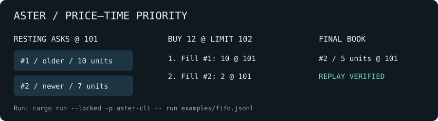

# Aster

[](https://github.com/willcook415/aster/actions/workflows/ci.yml)
[MIT licensed](LICENSE) · Rust 1.89+ · Windows / Ubuntu CI

Aster is a deterministic central limit order book and exchange matching engine
written in Rust. It models the core mechanics behind an exchange: accepting
commands, matching orders by price-time priority, emitting explicit events, and
rebuilding state from the same ordered command log.

The focus is correctness: typed integer prices and quantities, explicit state
transitions, and matching behaviour checked against an independent reference
model. This is a portfolio project, not production financial infrastructure.

## Quickstart

Requirements:

- Rust 1.89 or newer and Cargo. CI covers the declared minimum and stable on
  Windows and Ubuntu.

Clone the repository and run the default `mixed-session` scenario:

```bash
git clone https://github.com/willcook415/aster.git
cd aster
cargo run --locked -p aster-cli
```

List and run named scenarios:

```bash
cargo run -p aster-cli -- list
cargo run -p aster-cli -- scenario mixed-session
```

The report includes commands, emitted events, event counts, the complete final
book, allocator state, and replay verification.

## Try it in two minutes



```bash
cargo run --locked -p aster-cli -- run examples/fifo.jsonl
cargo run --locked -p aster-cli -- run-v2 examples/market-expiry.jsonl
```

The first example trades 10 units with the first seller, then 2 with the second,
leaving 5 at price 101. The second emits an explicit expiry for 3 unfilled units.
Edit the JSONL to explore your own commands. Unsupported fields fail clearly.

## What Aster Is

Aster currently provides:

- typed integer prices, quantities, identifiers, and priority sequences;
- bid and ask books with best-price selection;
- FIFO priority within each price level;
- limit and market orders, partial fills, full fills, and market remainder
  expiry;
- cancellation by order ID with participant ownership checks;
- explicit accepted, rejected, trade, and cancellation events;
- deterministic full-state snapshots and fresh-engine command replay;
- an independent reference model for matching comparisons;
- property-based state-machine comparisons over generated command sequences;
- V1 command/event/snapshot schema records with structural validation;
- completed-session persistence using JSONL command/event logs and snapshot
  JSON;
- custom JSONL input and a deterministic CLI scenario runner;
- opt-in V2 audit sequences, command correlation and explicit market expiry;
- a checksummed single-writer command journal with verified process-crash recovery;
- rule, invariant and property-based tests plus focused Criterion benchmarks.

Prices are integer ticks and quantities are integer units. Matching priority is
controlled by engine-assigned sequence numbers, never wall-clock timestamps.

## What Aster Is Not

Aster is not a trading bot, price predictor, crypto application, dashboard, or
complete exchange. It does not provide balances, positions, settlement, a risk
engine, networking, FIX, WebSockets, authentication, multi-symbol routing,
regulatory controls, or production operations.

See [Current limitations](docs/limitations.md) for the full, deliberately candid
boundary.

## Architecture at a Glance

The high-level flow is:

```text
EngineCommand
    -> validation and deterministic allocation
    -> price-time priority matching
    -> EngineEvent sequence
    -> updated OrderBook
    -> EngineSnapshot
```

Commands represent intentions; events represent facts produced by processing
those intentions. This distinction supports replay and audit:

```text
Command log = canonical replay input
Event log   = audit output
Snapshot    = deterministic summary/checkpoint
```

`AsterEngine` owns allocation and matching. `OrderBook` stores passive
liquidity. Versioned schema DTOs isolate persisted formats from internal domain
types. Completed sessions can be exported and verified without coupling file
I/O to the matching path.

Read [Architecture](docs/architecture.md) for module boundaries and
[Persistence](docs/persistence.md) for the saved-session contract.

## Worked Matching Example

1. Participant 1 submits a sell limit at 101 for quantity 10; it rests.
2. Participant 2 submits a buy limit at 102 for quantity 4.
3. The buy crosses the best ask.
4. A trade executes for quantity 4 at the resting price, 101.
5. The original sell order remains at the front of the ask level with quantity
   6 and its original priority.
6. Replaying those commands reproduces the same events, allocator state, and
   final book.

The precise rules are documented in
[Matching rules](docs/matching-rules.md).

## Repository Layout

```text
.
|-- crates/
|   |-- aster-core/        Matching, replay, schema, persistence, tests, benches
|   `-- aster-cli/         Built-in deterministic scenario runner
|-- docs/
|   |-- architecture.md
|   |-- matching-rules.md
|   |-- testing-strategy.md
|   |-- performance.md
|   |-- persistence.md
|   `-- limitations.md
`-- Cargo.toml
```

## Export and Verify a Session

Export the built-in mixed session:

```bash
cargo run -p aster-cli -- export mixed-session ./target/aster-session-smoke/mixed-session
```

This creates:

```text
./target/aster-session-smoke/mixed-session/
  commands.jsonl
  events.jsonl
  snapshot.json
```

Verify it by replaying the canonical command log and comparing the saved audit
outputs:

```bash
cargo run -p aster-cli -- verify ./target/aster-session-smoke/mixed-session
```

This V1 format uses deterministic complete-file writes and has no atomic
replacement guarantee. For per-command persistence use the separate journal:

```bash
cargo run --locked -p aster-cli -- journal examples/fifo.jsonl target/demo.aster
cargo run --locked -p aster-cli -- recover target/demo.aster
```

The journal synchronizes each complete command before acknowledging it, verifies
checksums and replay on recovery, and detects torn tails. Read the exact
[recovery contract and limits](docs/recovery.md) before using it.

## Tests and Quality Gates

Run the same core checks used for milestones:

```bash
cargo fmt --check
cargo clippy --workspace --all-targets -- -D warnings
cargo test --workspace
```

The [GitHub Actions workflow](.github/workflows/ci.yml) runs these checks on
every push and pull request, along with benchmark compilation, rustdoc
generation, and a focused CLI export/verify smoke test.

The test strategy includes:

- rule-focused engine and book tests;
- command atomicity and invariant tests;
- replay and session equality checks;
- an independent test-only matching model;
- schema golden fixtures and malformed snapshot validation;
- persisted-session round trips, corruption checks, and mismatch reporting.

See [Testing strategy](docs/testing-strategy.md).

## Benchmarks

Compile and run the Criterion suite with:

```bash
cargo bench -p aster-core
```

The workloads cover passive insertion, crossing matches, market sweeps,
cancellation at multiple queue positions, partial fills, rejection, serialization,
mixed sessions, and replay across multiple sizes and price-level shapes. They are development benchmarks, not
production capacity or latency claims. See
[Performance](docs/performance.md).

Caching aggregate quantities reduced the measured 4,000-order insertion workload
from 25.13 ms to 1.46 ms at one level, and from 191.34 ms to 2.85 ms across levels
on one Windows host. Tail cancellation remains linear and regressed in the same
run. The [case study](docs/benchmarks/cache-investigation.md) includes all 25
workloads, confidence intervals, method, and limitations; these are not general
exchange throughput claims.

## Documentation

- [Architecture](docs/architecture.md)
- [Matching rules](docs/matching-rules.md)
- [Testing strategy](docs/testing-strategy.md)
- [Performance and benchmark scope](docs/performance.md)
- [Persistence format and guarantees](docs/persistence.md)
- [Current limitations](docs/limitations.md)
- [V2 audit contract](docs/audit-events.md)
- [Journal and recovery](docs/recovery.md)
- [Decisions](docs/decisions.md) and [contribution guide](CONTRIBUTING.md)

## Current Status

The deterministic matching core, strict schemas, replay, V2 audit adapter,
custom-input CLI, and scoped journal are implemented. CI publishes generated
rustdoc as a downloadable artifact. Matching-model properties, malformed input,
quantity boundaries, and recovery fault cases are executable evidence.

The next performance investigation is queue-position cancellation. The next
recovery milestone is checkpoint/compaction design and request deduplication.
There is no networking, risk engine, multi-symbol routing, replication, or
production operations layer. See the limitations before interpreting the demo.

## License

[MIT](LICENSE).
